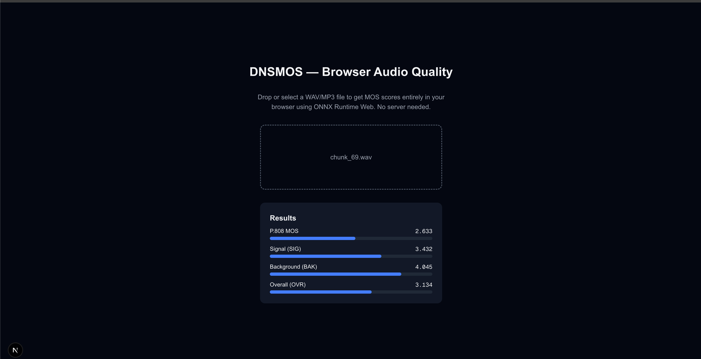

# DNSMOS — Browser Audio Quality Scorer

Client-side audio quality scoring powered by Microsoft's [DNSMOS](https://arxiv.org/abs/2010.15258) (Deep Noise Suppression Mean Opinion Score) models running entirely in the browser via [ONNX Runtime Web](https://onnxruntime.ai/docs/tutorials/web/). No server-side inference needed — zero compute cost.



## What it does

Drop or select a WAV/MP3 file and get four MOS scores instantly:

| Score | Description |
|-------|-------------|
| **P.808 MOS** | Overall quality (ITU-T P.808 scale) |
| **SIG** | Speech signal quality |
| **BAK** | Background noise quality |
| **OVR** | Overall speech + noise quality |

All inference runs in-browser using WebAssembly — nothing leaves your machine.

## How it works

1. Audio is decoded to 16 kHz mono PCM via the Web Audio API
2. A mel spectrogram is computed in JavaScript (replicating the Python/librosa pipeline)
3. Two small ONNX models run in parallel via `onnxruntime-web`:
   - `model_v8.onnx` (220 KB) — mel spectrogram → P.808 MOS
   - `sig_bak_ovr.onnx` (1.1 MB) — raw audio → SIG, BAK, OVR
4. Raw outputs are calibrated with polynomial fitting to produce final scores

## Project structure

```
mos-app/
├── app/
│   ├── lib/
│   │   └── dnsmos.ts        # ONNX inference, mel spectrogram, polyfit
│   ├── page.tsx              # Drag-and-drop UI
│   ├── layout.tsx
│   └── globals.css
├── public/
│   ├── models/
│   │   ├── model_v8.onnx     # P.808 MOS model
│   │   └── sig_bak_ovr.onnx  # SIG/BAK/OVR model
│   └── ort-wasm-*.wasm/.mjs  # ONNX Runtime Web binaries
export.py                      # Downloads ONNX models from torchmetrics cache
```

## Getting started

```bash
# Install dependencies
npm install

# (Optional) Re-download ONNX models from torchmetrics
cd .. && python export.py && cd mos-app

# Start dev server
npm run dev
```

Open [http://localhost:3000](http://localhost:3000) and drop an audio file.

## Tech stack

- **Next.js 16** (Turbopack) + React 19
- **ONNX Runtime Web** — WASM backend for model inference
- **Tailwind CSS 4** — styling
- **TypeScript** — end to end

## Notes

- The "Unknown CPU vendor" warning on Apple Silicon is cosmetic and suppressed via `ort.env.logLevel = "error"`. Inference is unaffected.
- Audio longer than 9 seconds is scored in overlapping hops and averaged.
- Audio shorter than 9 seconds is looped to meet the minimum length.
